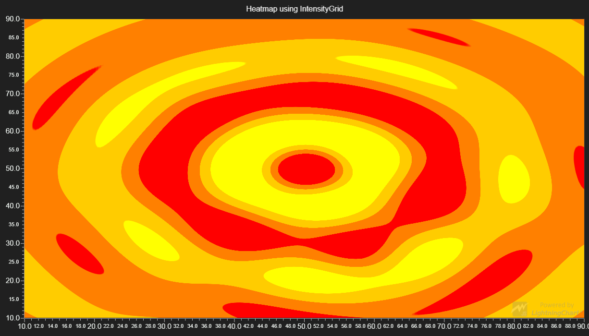

# Heatmap Grid



This demo application belongs to the set of examples for LightningChart JS, data visualization library for JavaScript.

LightningChart JS is entirely GPU accelerated and performance optimized charting library for presenting massive amounts of data. It offers an easy way of creating sophisticated and interactive charts and adding them to your website or web application.

The demo can be used as an example or a seed project. Local execution requires the following steps:

- Make sure that relevant version of [Node.js](https://nodejs.org/en/download/) is installed
- Open the project folder in a terminal:

        npm install              # fetches dependencies
        npm start                # builds an application and starts the development server

- The application is available at *http://localhost:8080* in your browser, webpack-dev-server provides hot reload functionality.


## Description

This example shows a simple use-case scenario for grid-based Heatmaps.

The data used for the heatmap is created using the WaterdropGenerator function in the example code.

Heatmaps are a powerful tool for visualizing magnitude in two dimensions. This example focuses on the IntensityGrid-type Heatmap Series.

Heatmaps can be created in XY Charts:

```javascript
// Add heatmap Series to a XY Chart
chartXY.addHeatmapSeries( {
    rows:       verticalResolution,
    columns:    horizontalResolution,
    start:      { x: 0, y: 0 },
    end:        { x: 100, y: 100 },
    pixelate:   false
})
```

# Heatmap Series options
Let's open up the options a bit more:

*rows*
Rows determine the *vertical resolution*, or density of each cell vertically.
*columns*
Columns determine the *horizontal resolution*, or density of each cell horizontally.
*start*
The position from where the heatmap will be rendered from.
*end*
The position to where the heatmap will be rendered to.
*pixelate*
If true, each cell will be rendered as-is; this will create a pixelated look for the heatmap.
If false, the cells will be interpolated to give the heatmap a cleaner look.

The *rows* and *columns* control the amount of data present in the heatmap; think of them as *cells* in a *matrix*.

The *start* and *end* position determine the *size* of the heatmap in the XY Chart's scale.

There are additional optional options available;
*type*
Which type of IntensitySeries should be used for the heatmap.
*xAxis*
The Horizontal Axis the heatmap should be attached to.
*yAxis*
The Vertical Axis the heatmap should be attached to.

# Heatmap series usage
Now that we have the heatmap specified, it's time to fill it with data.

```javascript
// Use invalidateValuesOnly to add data to the series and invalidate it.
// The data should be given as a matrix of numbers.
heatmap.invalidateValuesOnly( Matrix<number> )
// Optionally, it's also possible to go through each cell in the heatmap
// and fill the data using a callback
heatmap.invalidateValuesOnly( UpdateValueCallBack )
// Set a fillStyle to use for coloring the heatmap.
// Using a combination of PalettedFill and LUT allows coloring each cell
// depending on the data added.
heatmap.setFillStyle( new PalettedFill( { LUT } )
```

It is also possible to instead assign specific colors to each cell in the heatmap.
```javascript
// Use invalidateColorsOnly to add color to the series and invalidate it.
// The colors should be given as a matrix of colors.
heatmap.invalidateColorsOnly( Matrix<Color> )
// Optionally, a callback can be used to change color of each cell.
heatmap.invalidateColorsOnly( UpdateColorCallback )
// Set the fillStyle of the heatmap to IndividualPointFill, so each cell
// can be properly colored.
heatmap.setFillStyle( new IndividualPointFill() )
```


## API Links

* [XY cartesian chart]
* [Intensity Grid Series]
* [Paletted Fill]
* [Individual Point Fill]
* [Matrix]
* [LUT]
* [UpdateColorCallback]


## Support

If you notice an error in the example code, please open an issue on [GitHub][0] repository of the entire example.

Official [API documentation][1] can be found on [Arction][2] website.

If the docs and other materials do not solve your problem as well as implementation help is needed, ask on [StackOverflow][3] (tagged lightningchart).

If you think you found a bug in the LightningChart JavaScript library, please contact support@arction.com.

Direct developer email support can be purchased through a [Support Plan][4] or by contacting sales@arction.com.

[0]: https://github.com/Arction/
[1]: https://www.arction.com/lightningchart-js-api-documentation/
[2]: https://www.arction.com
[3]: https://stackoverflow.com/questions/tagged/lightningchart
[4]: https://www.arction.com/support-services/

© Arction Ltd 2009-2020. All rights reserved.


[XY cartesian chart]: https://www.arction.com/lightningchart-js-api-documentation/v2.2.0/classes/chartxy.html
[Intensity Grid Series]: https://www.arction.com/lightningchart-js-api-documentation/v2.2.0/classes/intensitygridseries.html
[Paletted Fill]: https://www.arction.com/lightningchart-js-api-documentation/v2.2.0/classes/palettedfill.html
[Individual Point Fill]: https://www.arction.com/lightningchart-js-api-documentation/v2.2.0/classes/individualpointfill.html
[Matrix]: https://www.arction.com/lightningchart-js-api-documentation/v2.2.0/globals.html#matrix
[LUT]: https://www.arction.com/lightningchart-js-api-documentation/v2.2.0/classes/lut.html
[UpdateColorCallback]: https://www.arction.com/lightningchart-js-api-documentation/v2.2.0/globals.html#updatecolorcallback

